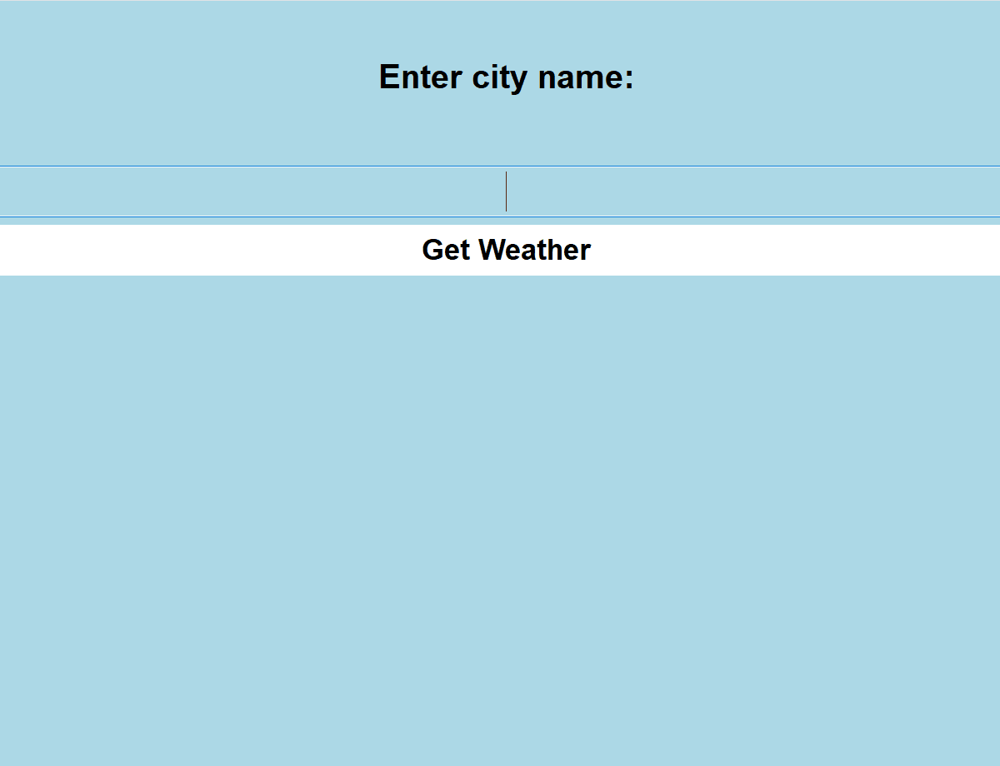

# Weather-Application with API

This project is a desktop weather application built using Python and PyQt5. It retrieves real time weather data from OpenWeatherMap API and displays the information using a graphical interface.

The focus of this project is on working with external data sources, handling errors safely, and building reliable software that responds correctly to different scenarios.

# Why I Built This Project

I built this project to gain experience working with real world APIs and to understand how software communicates with external systems. I also wanted to practise bulding GUIs and handling unreliable inputs such as incorrect city names or issues like the internet connection being down.

This project helped me undertand how production style applications must handle failures delicately.

# How the Application Works 

The user enters a city name, and the application sends an HTTP request to the OpenWeatherMap API. The reponse is returned in JSON format, which is then parsed and displayed by the GUI.

The application checks for different HTTP status codes and responds appropriately, ensuring the user recieves clear feedback rather than the program failing unexpectedly.

# Key Technical Concepts Used

This project demonstrates:

* API integration using HTTP requests
* JSON parsing and data extraction
* GUI development using PyQt5
* structured error handling for multiple failure scenarios
* validation of user input
* seperation of logic into methods of readability
* secure handling of sensitive data using environment variables

# Security and Reliability Considerations

To follow good security practices, the API key is stored in an environment variable rather than being hard coded into the source code. This prevents sensitive data from being exposed in version control.

The application also handles:

* invalid API keys
* incorrect city names
* rate limiting
* server side errors
* network connectivity issues


# Challenge and Learning Outcomes

A big challenge I had to overcome was PyQt5 not working even with me importing it but after doing research I found out that it is not compatible with Python 3.14 (the version I had been using in Pycharm) and had to go back to using 3.12 version for it to work but even after changing there was no difference so after trying new things I figured out that I had to uninstall the 3.14 version for Pycharm to recognise 3.12 version as the main one and it finally worked after many hours of trying to fix this issue.

Another issue was understanding how different API reponse codes should be handled. I solved this by explicitly checking status codes and displaying meaningful error messages that match the status codes.

# Future Improvements

With additional development time and experience, I would:

* add a multiday forecast
* allow users to save favourite locations like London
* include temperature unit switching for example Celcius to Fahrenheit
* build a web based version of this application

# Demo



# How to run

```
pip install -r requirements.txt
python Weather app.py
```
